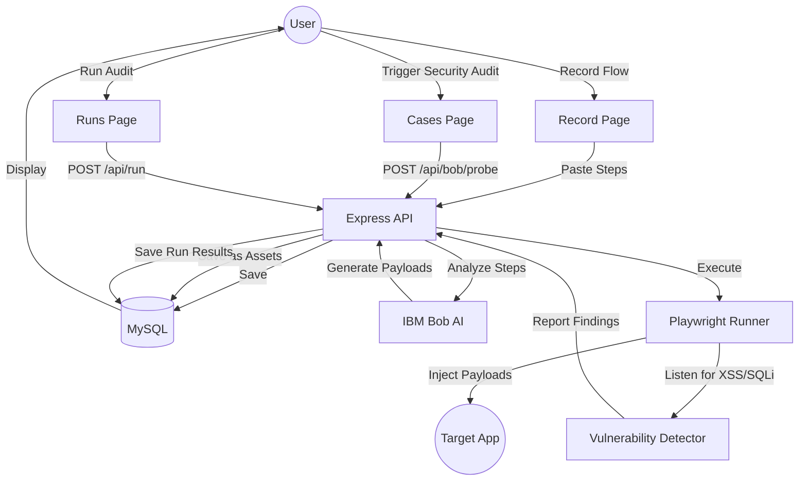

# Project Flow: Security Probing

## 1. Recording Phase
- User records a "Happy Path" using `playwright codegen`.
- The raw steps are saved as a `test_case`.

## 2. Analysis Phase (The "Bob" Part)
- Bob AI reviews the selectors and labels in the steps.
- For each `<input>`, Bob suggests a payload based on the field type (e.g., `<script>` for search, `' OR 1=1` for login).
- These are saved as `test_assets` linked to the case.

## 3. Probing Phase (The "Runner" Part)
- The Playwright service iterates through the steps.
- It replaces `[variable]` placeholders with the security payloads.
- **Active Detection**:
    - `page.on('dialog')`: Confirms XSS if an alert/confirm is triggered.
    - `page.on('console')`: Detects execution tokens or DB error leaks.
    - `response.text()`: Scans for SQLi error strings (e.g., "SQL syntax error").

## 4. Reporting Phase
- Results are marked as `VULNERABLE` if any detector triggers.
- Screenshots are captured at the moment of detection.
