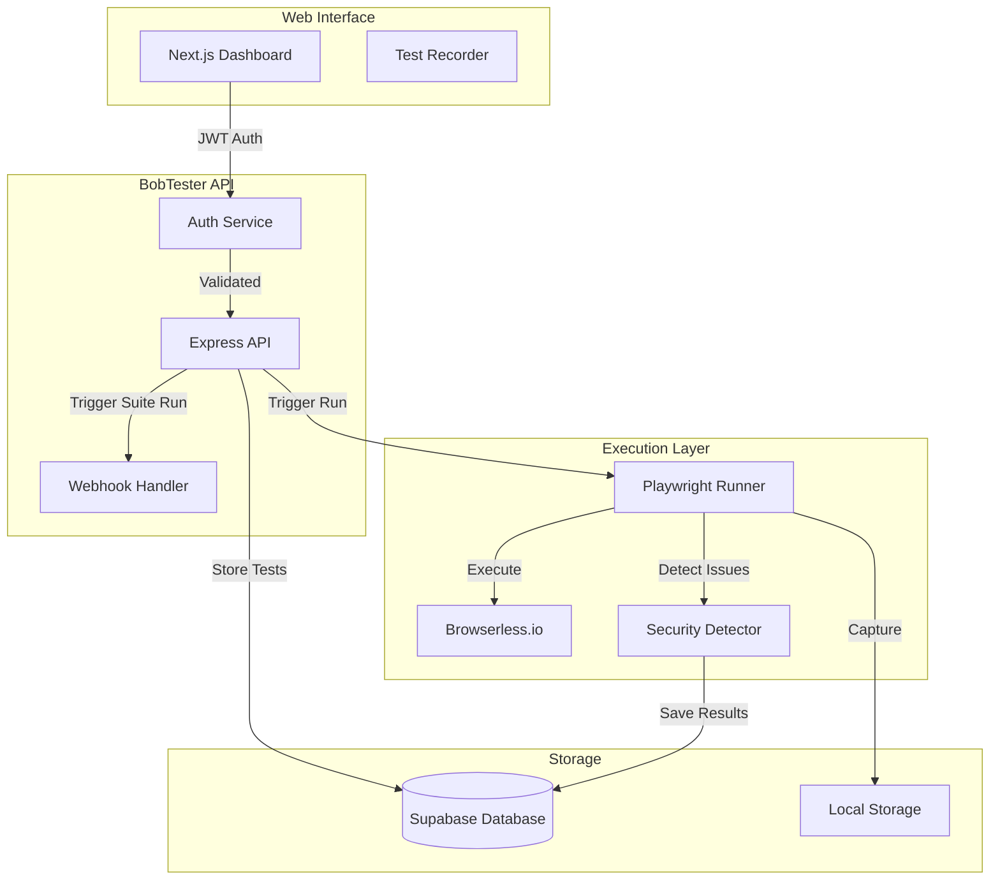
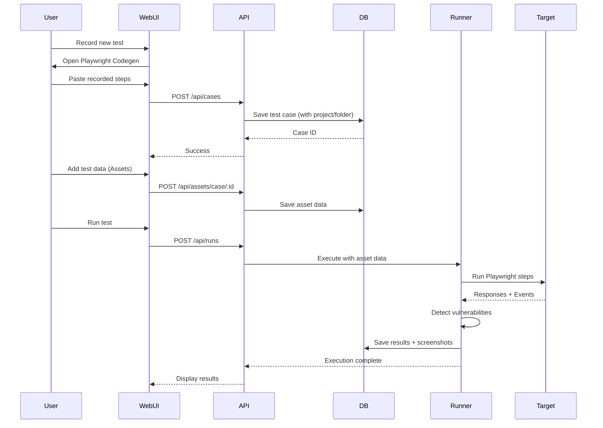
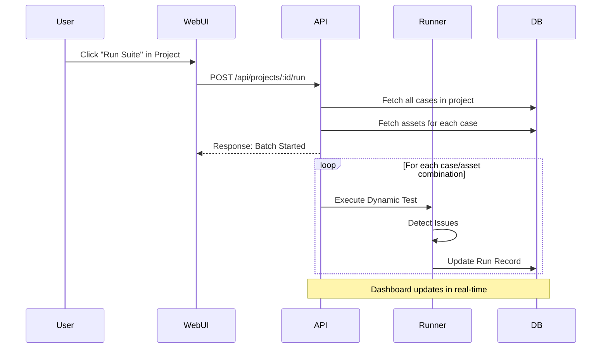

# Project Flow

## Architecture Overview

## Flow 1: Web UI Recording & Execution

## Flow 2: Project Suite (Batch) Execution

## Key Components

### 1. Recording Phase

- User records tests via Web UI using Playwright Codegen
- Steps are saved as JSON in the database
- Test cases are organized into **Projects** and **Folders**
- Test data (assets) can be added for parameterization

### 2. Execution Phase

- Playwright Runner executes tests via Browserless.io
- Variable substitution: `[variable]` replaced with asset data
- **Active Detection**:
  - `page.on('dialog')`: Detects XSS via alert/confirm dialogs
  - `page.on('console')`: Monitors console for errors/tokens
  - `response.text()`: Scans for SQLi error strings

### 3. Reporting Phase

- Results marked as `PASSED`, `FAILED`, `VULNERABLE`, or `WARNING`
- Screenshots captured at success/failure moments
- Detailed logs and vulnerability reports
- Project-wide statistics shown on dashboard
