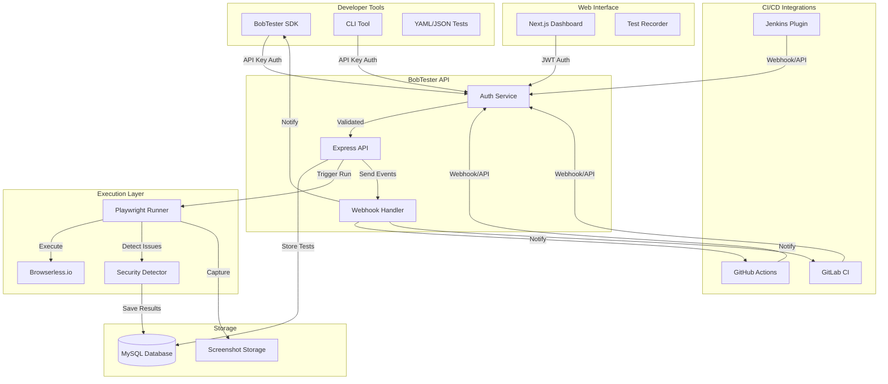
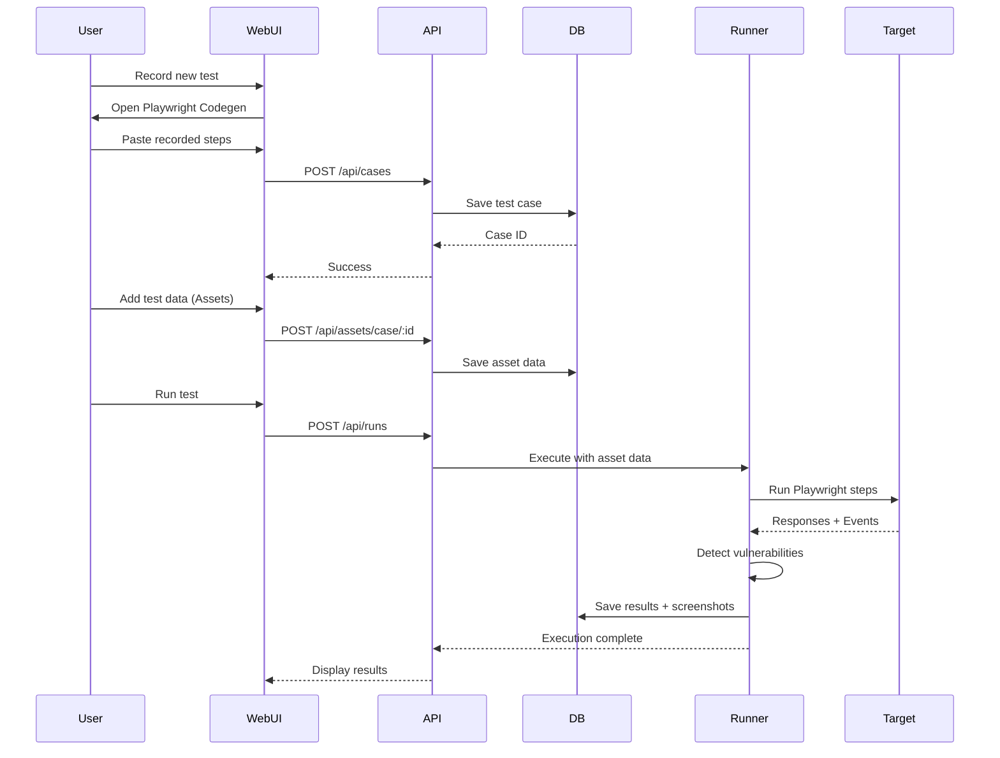
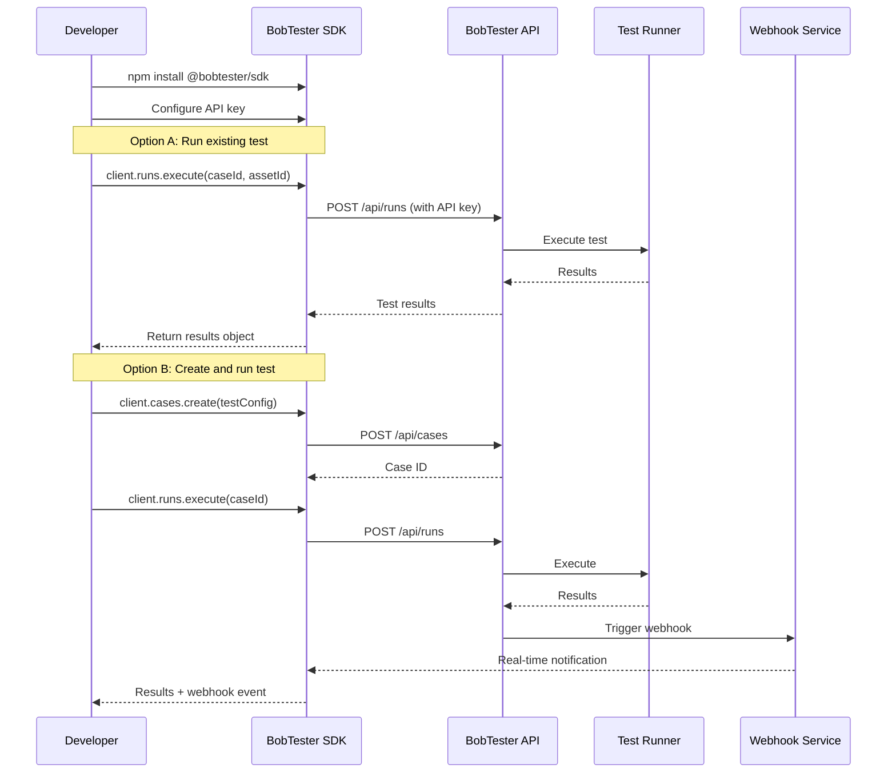
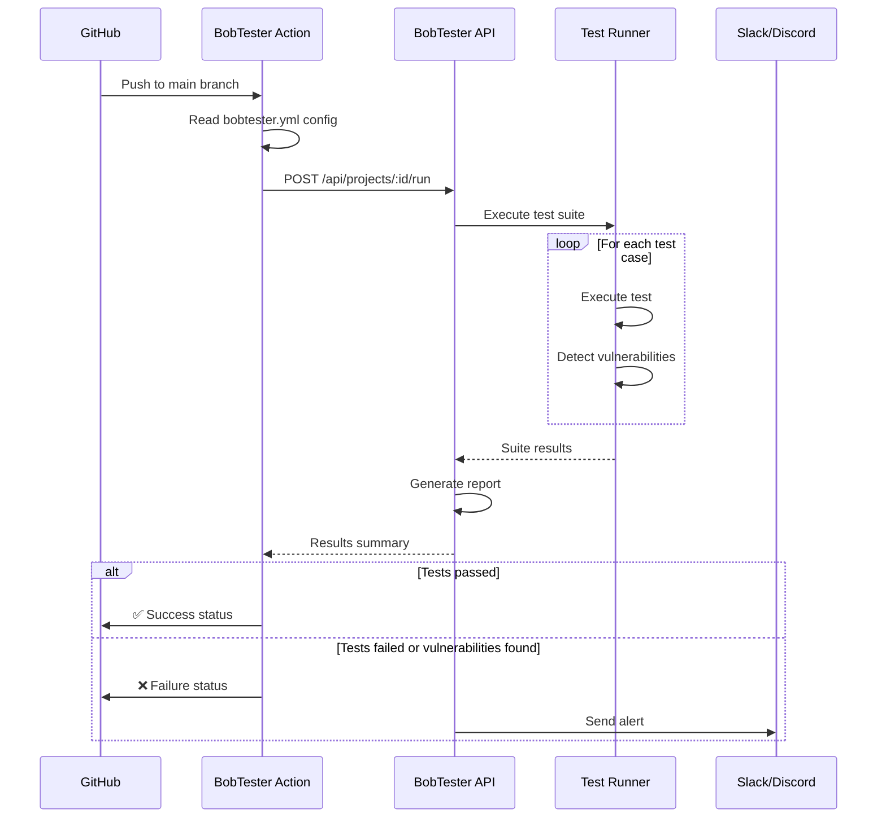
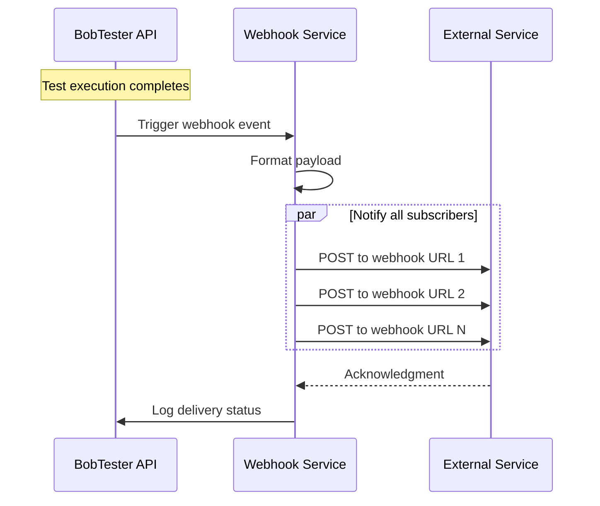

# Project Flow: SDK + Developer Integration

## Architecture Overview

## Flow 1: Web UI Recording (Traditional)

## Flow 2: SDK Integration (Programmatic)

## Flow 3: CI/CD Integration (GitHub Actions)

## Flow 4: Webhook Notifications

## Key Components

### 1. Recording Phase

- User records tests via Web UI using Playwright Codegen
- Steps are saved as JSON in the database
- Test data (assets) can be added for parameterization

### 2. SDK Integration

- Developers install `@bobtester/sdk` package
- Authenticate using API keys
- Programmatically create, manage, and execute tests
- Receive real-time results and webhook notifications

### 3. Execution Phase

- Playwright Runner executes tests via Browserless.io
- Variable substitution: `[variable]` replaced with asset data
- **Active Detection**:
  - `page.on('dialog')`: Detects XSS via alert/confirm dialogs
  - `page.on('console')`: Monitors console for errors/tokens
  - `response.text()`: Scans for SQLi error strings

### 4. CI/CD Integration

- GitHub Actions, GitLab CI, Jenkins plugins
- Automated test execution on code changes
- Webhook notifications to Slack/Discord
- Test results integrated into PR checks

### 5. Reporting Phase

- Results marked as `PASSED`, `FAILED`, or `VULNERABLE`
- Screenshots captured at key moments
- Detailed logs and vulnerability reports
- Real-time notifications via webhooks
